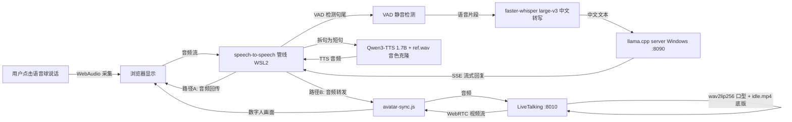

# 架构设计: local-ai-companion-v2

> 本文档将**已验证的零度解说方案（2026-08-03）**文档化为正式架构。技术栈已固定（见 PRD 与项目简介），本设计不做新的技术选型，只负责把组件拼图、端口、数据链路、部署拓扑、显存预算与安全底线落实到可执行的设计。
>
> 权威输入：`knowledge/PRD.md`（10 用户故事）、`knowledge/项目简介.md`、CONSTITUTION.md（SEC-01~20）。

---

## 1. 系统组件图

```
┌──────────────────────────────────────────────────────────────────────────┐
│ Windows 主机  (RTX 5060 Ti 16GB / 16GB 内存 / SSD)                        │
│                                                                            │
│  ┌─────────────────────────┐      ┌────────────────────────────────────┐  │
│  │ ① llama.cpp server      │      │ 浏览器 Chrome/Edge (用户侧)        │  │
│  │    (Windows 原生进程)    │      │  Gradio UI  @ http://localhost:7860 │ │
│  │    :8090                 │      │  - 数字人画面(WebRTC 视频)          │  │
│  │    Qwen3-8B/14B Q4_K_M   │      │  - 语音球 / 麦克风(WebAudio 采集)   │  │
│  │    OpenAI 兼容 API       │      │  - 聊天记录 / 输入框                │  │
│  │    stream=true SSE       │      │  - 停止按钮 / 连接状态              │  │
│  └────────────┬────────────┘      └──────────▲───────────────────▲─────┘  │
│               │ 流式对话 (经 WSL2 转发)       │ WebRTC 视频流      │ 麦克风│
│               │                              │ (数字人画面)        │ /播放 │
│  ┌─────────────────────────┐                 │                    │       │
│  │ ComfyUI + Wan2.2        │ (一次性离线生成  │                    │       │
│  │ 非运行时组件, 只做一步)  │  idle.mp4 后退出)│                    │       │
│  └─────────────────────────┘                 │                    ▼       │
├──────────────────────────────────────────────┼────────────────────────────┤
│ WSL2 Ubuntu 24.04  (本地转发: WSL 服务经      │        ┌──────────────────┐│
│  localhost 端口映射对 Windows 可见)           │        │  WSL2 端口转发    ││
│                                               ▼        │  7860/8010/8011  ││
│  ┌───────────────────────────────────────────────┐    └──────────────────┘│
│  │ ② speech-to-speech 管线 (Python)  @ :7860     │                        │
│  │    Gradio 是用户主界面                         │                        │
│  │    ┌────────┐  ┌────────────────┐  ┌─────────┐ │                        │
│  │    │ VAD     │→ │ faster-whisper │→ │ LLM转发 │ │  ←→ ① llama-server   │
│  │    │ 静音检测 │  │ large-v3 (中文) │  │ (SSE)   │ │     (WSL2→Windows)  │
│  │    └────────┘  └────────────────┘  └─────────┘ │                        │
│  │    ┌───────────────┐   ┌────────────────────┐  │                        │
│  │    │ Qwen3-TTS 1.7B │ ← │ 拆句/流式/打断控制  │  │                        │
│  │    │ + 音色克隆 ref │   └────────────────────┘  │                        │
│  │    └───────┬───────┘                            │                        │
│  └────────────┼────────────────────────────────────┘                        │
│               │ TTS 音频 (双路: 回传浏览器播放 + 转发驱动口型)              │
│  ┌────────────▼────────────────────────────────────┐                       │
│  │ ③ avatar-sync.js (Node.js)                      │                       │
│  │    - 接收 TTS 音频并转发给 LiveTalking            │                       │
│  │    - 数字人背景层 / WebRTC 画面接入 (端口: 8011,  │                       │
│  │      以零度教程实现为准)                         │                       │
│  └────────────┬────────────────────────────────────┘                       │
│               │ 音频 (驱动口型)                                             │
│  ┌────────────▼────────────────────────────────────┐                       │
│  │ ④ LiveTalking (Python)  @ :8010                 │                       │
│  │    - wav2lip256 用音频驱动口型                    │                       │
│  │    - 以 idle.mp4 为底版合成 talking-head 帧       │                       │
│  │    - WebRTC 低延迟推送视频                        │                       │
│  └─────────────────────────────────────────────────┘                       │
└──────────────────────────────────────────────────────────────────────────────┘
```

> 启动顺序（已验证）：① llama-server（Windows CMD）→ ② start-livetalking.sh（WSL）→ ③ start-voice.sh（WSL）。浏览器打开 `localhost:7860`。

---

## 2. 组件职责

| 组件 | 一句话职责 | 关键配置 |
| --- | --- | --- |
| ① llama.cpp server（Windows 原生） | 承载本地大模型 Qwen3，提供 OpenAI 兼容流式对话接口 | 模型：`Qwen3-8B-Instruct-Q4_K_M.gguf`（16GB 卡默认）或 `Qwen3-14B-Instruct-Q4_K_M.gguf`（24GB 卡推荐）；`--host 0.0.0.0 --port 8090`（零度教程验证值，见 6.5 安全偏离项）；`-ngl 999` 全量 GPU 卸载 |
| ② speech-to-speech 管线（Python，Gradio :7860） | 用户主界面 + 语音对话编排：VAD → ASR → LLM 转发 → TTS → 播放，并管理打断/状态机 | `VAD_THRESH`（静音阈值）、`MIN_SILENCE_MS`（最小静音时长）、`LLM_BASE_URL=http://localhost:8090`、`LLM_MODEL=qwen3-8b`、TTS 参考音频 `ref.wav` |
| ③ avatar-sync.js（Node.js） | 数字人链路桥接：接收 TTS 音频转发给 LiveTalking，并接入数字人背景层/WebRTC 画面 | 端口 `8011`（以零度教程为准，实现时确认）；上游：speech 管线；下游：LiveTalking :8010 |
| ④ LiveTalking（Python，:8010） | wav2lip256 实时口型驱动 + WebRTC 视频推送 | 权重 `wav2lip256.pth`；底版 `idle.mp4`（704x896、5s、闭嘴+眨眼+呼吸）；WebRTC 信令服务 |
| ComfyUI + Wan2.2（一次性，非运行时） | 离线生成数字人底版 `idle.mp4`（写实女性、闭嘴、眨眼、轻微呼吸） | 分辨率 704x896、时长 5s；一次性操作后即可卸载/关闭；换角色需重新生成 |

**数字人状态机**（v2 沿用原始需求的 4 状态，驱动浏览器与口型行为）：

```
待机 ──(用户开始录音)──▶ 倾听 ──(输入完成)──▶ 思考 ──(AI首句语音就绪)──▶ 说话
  ▲                          ▲                 │                        │
  └────────(回复结束)─────────┴────────(用户打断/停止，最高优先级)────────┘
```

规则：任意时刻单状态；`停止` 与用户语音输入优先级最高；打断时取消 LLM 后续流、TTS 队列、音频播放与说话状态，并释放资源防串音。

---

## 3. 数据流（麦克风 → 浏览器画面与声音）



**完整链路（文字版）**：

1. 用户在浏览器点击语音球说话，麦克风音频经 WebAudio 采集并实时送入 WSL2 的 speech-to-speech 管线（经 Gradio WebSocket）。
2. 管线内 VAD 检测到用户说完（静音超过 `MIN_SILENCE_MS`），截取语音片段交给 faster-whisper large-v3 转写为中文文本。
3. 转写文本由 LLM 转发模块以 OpenAI 兼容格式调用 **Windows 侧 llama-server**（`POST /v1/chat/completions, stream=true`），流式获取 AI 回复；回复文本同步回浏览器聊天记录（流式展示）。
4. 回复按自然停顿拆分为短句，逐句送 Qwen3-TTS 1.7B 合成音频（音色来自 `ref.wav` 克隆）。
5. TTS 音频**双路分发**：A 路回传浏览器经 WebAudio 播放（用户听到声音）；B 路经 avatar-sync.js 转发给 LiveTalking。
6. LiveTalking 以 `idle.mp4` 为底版、wav2lip256 按音频实时驱动口型，合成 talking-head 帧后经 WebRTC 推送；avatar-sync.js 把数字人画面作为背景层接入浏览器。
7. 用户重新说话或点击停止：管线取消 LLM 后续流、TTS 队列、音频播放与说话状态，数字人回到倾听，新一轮无串音（US-04 验收 ≤500ms 停止）。

**文字兜底（US-06）**：停用 ASR 后，用户在输入框发文字，同样进入 LLM 转发 → 流式文本 →（可选）TTS → 口型链路。

---

## 4. 部署拓扑

| 侧 | 运行内容 | 监听地址 | 端口 | 说明 |
| --- | --- | --- | --- | --- |
| Windows（原生） | llama.cpp llama-server | `0.0.0.0`（零度教程默认）/ 建议收紧为 `127.0.0.1` | 8090 | OpenAI 兼容 `/v1/chat/completions`；`GET /health` |
| Windows（一次性） | ComfyUI + Wan2.2 | — | — | 离线生成 `idle.mp4` 后退出，不常驻 |
| WSL2 | speech-to-speech 管线（Gradio） | `127.0.0.1` | 7860 | 用户主界面；WSL2 localhost 转发对 Windows 可见 |
| WSL2 | LiveTalking（wav2lip256 + WebRTC） | `127.0.0.1` | 8010 | 口型驱动 + WebRTC 推送 |
| WSL2 | avatar-sync.js（Node） | `127.0.0.1` | 8011（实现时确认） | TTS 音频转发 + 数字人背景层/WebRTC 接入 |
| 浏览器 | Chrome/Edge | `http://localhost:7860` | — | Gradio UI + WebRTC 视频 + WebAudio 收放音 |

**WSL2 ↔ Windows 互通说明**：
- WSL2 访问 Windows 侧 llama-server：默认启用 `localhostForwarding` 时，WSL2 内可用 `http://localhost:8090` 直连 Windows 服务；若不可用，退化为通过 Windows 主机 IP（`/etc/resolv.conf` nameserver）访问，此时 llama-server 必须监听 `0.0.0.0`（零度教程采用此方案）。
- Windows 浏览器访问 WSL2 服务：WSL2 自动把 WSL 内 `127.0.0.1` 端口映射到 Windows `localhost`，故浏览器可直接打开 `localhost:7860` / `localhost:8010`。

**启动/停止编排**：
- 启动（已验证顺序）：`start-llama.bat`（Windows）→ `start-livetalking.sh`（WSL）→ `start-voice.sh`（WSL）。
- 停止：逐脚本退出并清理残留进程与端口占用；支持重复启停（PRD 兼容性要求）。
- 就绪信号：各脚本轮询 `GET /health`（或等价探活）后再输出"就绪"，避免用户误判页面未加载完成。

---

## 5. 文件与目录布局

### 5.1 项目 Git 仓库（Windows 源码侧）

```
chatAI-comPes/
├── knowledge/                      # 团队知识（本目录）
│   ├── 项目简介.md
│   ├── PRD.md
│   ├── 架构设计.md
│   └── API契约.md
├── docs/                           # 历史文档（v1 遗留，仅供参考）
├── outputs/
│   ├── frontend/                   # Developer 产出（Gradio 定制 / 未来 React 升级）
│   ├── backend/                    # Developer 产出（管线、脚本、avatar-sync）
│   ├── qa/                         # QA 产出
│   └── reviewer/                   # Reviewer 产出
├── scripts/                        # 部署与编排脚本（同步/拷贝到 WSL ~/setup/）
│   ├── install-voice.sh            # 首次安装：venv、pip 依赖、模型下载、环境检查
│   ├── start-voice.sh              # 启动 speech-to-speech 管线 Gradio (:7860)
│   ├── start-livetalking.sh        # 启动 LiveTalking (:8010)
│   ├── start-llama.bat             # Windows 侧启动 llama-server (:8090)
│   ├── stop-all.bat / stop-all.sh  # 一键停止 + 端口清理
│   └── avatar-sync.js              # 音频转发 + 数字人背景层（Node）
├── config/
│   └── voice.yaml                  # VAD_THRESH / MIN_SILENCE_MS / LLM_BASE_URL / 端口等
├── assets/                         # 运行时资产（拷贝到 WSL ~/setup/）
│   ├── idle.mp4                    # 数字人底版（ComfyUI+Wan2.2 一次性生成）
│   ├── wav2lip256.pth              # 口型权重
│   └── ref.wav                     # 音色克隆参考音频（示例，可被用户上传覆盖）
├── models/                         # Windows 侧模型（可选放此或自定义目录）
│   └── Qwen3-8B-Instruct-Q4_K_M.gguf
├── 3D真人数字人效果图.png           # 视觉参考
├── .env.example                    # 环境变量模板（v1 遗留，v2 改用 voice.yaml）
├── team-config.yaml
└── workflow-state.md
```

### 5.2 WSL2 运行时目录 `~/setup/`

```
~/setup/
├── install-voice.sh                # 从仓库 scripts/ 拷贝/同步
├── start-voice.sh
├── start-livetalking.sh
├── avatar-sync.js
├── voice.yaml                      # 运行时配置
├── wav2lip256.pth                  # 口型权重（来自 assets/）
├── idle.mp4                        # 数字人底版（来自 assets/）
├── ref.wav                         # 音色克隆参考音频
├── venv/                           # Python 虚拟环境（首次 install 创建）
├── models/                         # 模型权重（首次联网下载）
│   ├── faster-whisper-large-v3/
│   └── Qwen3-TTS-1.7B/
├── uploads/                        # 运行时：用户上传的参考音频（US-03）
└── logs/                           # 运行时日志
    ├── voice.log
    ├── livetalking.log
    └── avatar-sync.log
```

### 5.3 Windows 侧运行时

```
（自定义模型目录，如 D:\models\llama.cpp\ 或项目 models/）
├── Qwen3-8B-Instruct-Q4_K_M.gguf   # 16GB 卡默认
└── (可选) Qwen3-14B-Instruct-Q4_K_M.gguf  # 24GB 卡推荐
llama-server.exe                    # llama.cpp 官方 release 二进制
```

---

## 6. 技术选型（已固定，附选型理由摘要）

| 能力 | 技术 | 理由摘要 |
| --- | --- | --- |
| 大模型 | llama.cpp + Qwen3（8B 默认 / 14B 推荐） | 零度方案已验证；llama.cpp 纯本地、GGUF 量化、CUDA 卸载；8B Q4_K_M ≈6GB 适配 16GB 卡 |
| 前端 UI | Gradio（speech-to-speech 自带） | 零度方案自带、改动最小；满足"页面简洁"；升级 React 留待后续 |
| 语音识别 | faster-whisper large-v3 | 中文转写质量高、CTranslate2 推理快、纯本地 |
| 语音合成 | Qwen3-TTS 1.7B + 音色克隆 | 本地小体积、支持 5-15s 参考音频克隆（US-03） |
| 数字人视觉 | ComfyUI + Wan2.2（idle.mp4）+ wav2lip256 + LiveTalking | Wan2.2 生成写实底版（闭嘴+眨眼+呼吸）；wav2lip256 实时口型；LiveTalking WebRTC 低延迟推送；满足"非预录、非静态" |
| 桥接层 | avatar-sync.js（Node.js） | 音频转发 + 数字人背景层，串起 speech 管线与 LiveTalking |
| 运行环境 | WSL2 Ubuntu 24.04 + Windows 原生 | AI 链路在 WSL2（Python/Node 生态齐），llama-server 在 Windows（GPU 直通稳定） |
| 编排 | Bash (.sh) + Batch (.bat) | 跨 Windows/WSL 的一键启停 |

---

## 7. 显存预算

| 组件 | 16GB 卡 / 8B 配置（默认） | 24GB 卡 / 14B 配置（推荐） |
| --- | --- | --- |
| llama.cpp Qwen3 | Qwen3-8B Q4_K_M ≈ **6 GB** | Qwen3-14B Q4_K_M ≈ **9 GB** |
| faster-whisper large-v3 | ≈ 2 GB | ≈ 2 GB |
| Qwen3-TTS 1.7B | ≈ 2 GB | ≈ 2 GB |
| wav2lip256 | ≈ 2 GB | ≈ 2 GB |
| 系统/图形缓冲等 | ≈ 2 GB | ≈ 2 GB |
| **合计（常驻稳态）** | **≈ 14 GB** | **≈ 17 GB** |
| 显存上限 | 16 GB | 24 GB |
| **余量** | **≈ 2 GB** | **≈ 7 GB** |

预算说明：
- ComfyUI + Wan2.2 **不常驻**，仅在一次性生成 `idle.mp4` 时占用高显存，届时需临时关闭其他服务。
- 16GB 卡处于上限边缘（余量仅 ~2GB）：默认 8B；必要时串行加载组件、关闭未用模型；OOM 时输出可理解错误提示并可重启恢复（PRD 验收 7）。
- 系统内存 16GB 偏紧：LLM 与 TTS 并行可能吃紧；MVP 可跑通，长期稳定建议 32GB。

---

## 8. 安全设计（SEC-01~20 逐条结论）

**总体定性**：本项目 100% 本地、单用户、无认证、无数据库、无公网暴露。多数 SEC 规则面向 Web 服务与用户数据，在本项目"不适用"或"弱化为本地约束"。仍适用的规则与本地特殊性绑定。

| ID | 规则 | 级别 | 本项目结论 |
| --- | --- | --- | --- |
| SEC-01 | SQL 必须参数化，禁止拼接 | 致命 | **不适用**——本项目无数据库。 |
| SEC-02 | 禁止 eval()/exec()/Function() | 致命 | **适用**——管线代码（Python/Node）不得对模型输出或用户文本执行动态代码；LLM 输出只作文本处理。 |
| SEC-03 | 禁止命令注入，进程调用用参数数组 | 致命 | **适用（关键）**——所有子进程调用（faster-whisper、llama-server、Qwen3-TTS 等）必须用参数数组/API 调用，禁止把用户输入拼进 shell 字符串。 |
| SEC-04 | HTML 转义防 XSS | 致命 | **适用**——LLM 回复作为文本渲染；Gradio 默认安全转义；若自定义前端，禁止 `innerHTML` 直插模型输出。 |
| SEC-05 | 文件路径校验防路径遍历 | 致命 | **适用**——参考音频上传路径必须限定在 `~/setup/uploads/` 内，校验文件名与扩展名。 |
| SEC-06 | 禁止硬编码密钥/Token | 致命 | **不适用（弱化）**——无 API Key/Token；模型路径、端口等仍走 `voice.yaml`/环境变量，不硬编码。 |
| SEC-07 | 密码必须 bcrypt/argon2 | 致命 | **不适用**——无用户认证、无密码。 |
| SEC-08 | JWT 必须有过期时间 | 高 | **不适用**——无 JWT。 |
| SEC-09 | 敏感接口必须权限校验 | 致命 | **不适用**——无支付/用户数据/管理后台；服务仅绑定 127.0.0.1。 |
| SEC-10 | 日志禁止记录敏感信息 | 高 | **适用（本地弱化）**——无密码/Token；但本地日志不得记录用户可识别隐私（完整声纹特征除外，录音仅本地临时存储），参考音频不写日志。 |
| SEC-11 | 异常不暴露堆栈 | 中 | **适用（关键，PRD 验收点）**——Gradio 前端显示可理解的错误（显存不足、服务未就绪、ASR 失败），不向浏览器透出 Python 堆栈。 |
| SEC-12 | 文件上传校验类型与大小 | 高 | **适用**——参考音频白名单扩展名（wav/mp3/m4a/flac）+ 大小上限（建议 ≤15MB）+ 时长 5-15s 校验。 |
| SEC-13 | GET 请求禁止改数据 | 高 | **适用**——Gradio 内部与自定义接口中，改状态一律 POST；GET 仅用于页面与探活。 |
| SEC-14 | CORS 不允许 * + credentials | 高 | **不适用（弱化）**——服务仅 127.0.0.1，无跨站 credentials；浏览器直接调用 llama-server 时如遇 CORS 限制，配置白名单为 `http://localhost:7860` 而非 `*`。 |
| SEC-15 | Cookie HttpOnly+Secure+SameSite | 中 | **不适用**——无 Cookie。 |
| SEC-16 | 批量操作上限/限流 | 中 | **不适用（弱化）**——单用户本机；Gradio 层加简单并发保护（防止重复提交/连点）即可。 |
| SEC-17 | API 响应不过度暴露字段 | 低 | **适用**——自定义接口只返回所需字段（文本、状态、错误码），不暴露模型路径、内部配置。 |
| SEC-18 | 依赖漏洞检查 | 中 | **适用**——对 wav2lip256 / LiveTalking / faster-whisper / Qwen3-TTS 的 Python 依赖与 Node 依赖执行 `pip-audit` / `npm audit`，锁版本。 |
| SEC-19 | 禁止默认密码 | 高 | **不适用**——无密码。 |
| SEC-20 | 数据库连接池 | 中 | **不适用**——无数据库。 |

**项目特定安全偏离（需要处理）**：
- 零度教程 llama-server 使用 `--host 0.0.0.0 --port 8090`，会监听所有网卡，与 PRD"服务仅绑定 127.0.0.1"冲突。缓解（择一）：
  1. 若 WSL2 `localhostForwarding` 可用，改为 `--host 127.0.0.1`，WSL2 仍可用 `localhost:8090` 访问；
  2. 保持 `0.0.0.0` 但添加 Windows 防火墙入站规则，仅允许本机/本地子网访问 8090。
- 所有 WSL2 服务（7860/8010/8011）默认仅监听 WSL 内 `127.0.0.1`，配合 WSL2 localhost 转发对 Windows 可见，不暴露公网。

---

## 9. 已知风险与缓解措施

| # | 风险 | 等级 | 影响 | 缓解措施 |
| --- | --- | --- | --- | --- |
| R1 | **显存处于上限边缘**：16GB 卡 + 8B 配置余量仅 ~2GB，14B + 全套常驻可能 OOM | 高 | 对话中断/无响应 | 默认 8B；串行加载组件；关闭未用模型；OOM 时输出可理解错误并可重启恢复（PRD 验收 7） |
| R2 | **系统内存 16GB 偏紧**：LLM 与 TTS 并行吃紧 | 高 | 卡顿/swap | 限制并发；MVP 只保证基础运行；文档建议升级 32GB |
| R3 | **llama-server 0.0.0.0 暴露**：与"仅 127.0.0.1"约束冲突 | 中 | 局域网内可达 | 见 §8 安全偏离；改 127.0.0.1 或加防火墙入站规则 |
| R4 | **首响延迟达标难**：P50≤2s/P95≤3s 需全链路优化 | 中 | 体验差 | 回复拆短句立即送 TTS；ASR/LLM/TTS 并行预热；LLM 用流式首 token 快出 |
| R5 | **口型同步偏差**：wav2lip256 非音素级，WebRTC 有传输延迟 | 中 | 口型与声音偏差 | 底版要求闭嘴；控制音频/视频同源时钟；验收阈值 ≤300ms |
| R6 | **打断串音**：旧轮残留音频/状态混入新轮 | 中 | 验收 6 失败 | 取消令牌贯穿 LLM/TTS/播放；停止后资源释放；状态机单状态约束 |
| R7 | **音色克隆质量依赖参考音频**：噪声/语速异常降质 | 中 | US-03 验收失败 | 上传前校验 5-15s 清晰单人声；给出提示 |
| R8 | **首次下载体积大**：模型+Wan2.2 需联网且磁盘大 | 中 | 安装耗时 | install 脚本校验哈希（PRD 安全要求"可信来源"）；断网后完全离线 |
| R9 | **wav2lip 视觉限制**：2D 写实 talking-head，表情/动作受底版限制 | 低 | 与 3D 愿景有差距 | 明确 v2 边界；换角色需重生成 idle.mp4 |
| R10 | **Gradio UI 定制受限** | 低 | 页面样式不够精致 | v2 用基线形态满足验收；React 升级留待后续 |
| R11 | **WebRTC 受网络环境影响** | 低 | 跨 WLAN 抖动 | 本机 localhost 为最佳场景；不承诺公网/跨 WLAN 稳定 |

---

## 10. 里程碑映射（开发落地顺序）

| 里程碑 | 覆盖组件 | 关键验收 |
| --- | --- | --- |
| M1 基础闭环 | ① llama-server + ② Gradio 文本链路 + 数字人待机画面 | `localhost:7860` 可访问；数字人待机 + 语音球 + 文字流式回复 |
| M2 语音闭环 | ② 全链路（VAD/ASR/LLM/TTS/播放）+ 语音球 | 麦克风→转写→回复→TTS 播放全本地；文字兜底可用 |
| M3 真人感联动 | ③ ④ LiveTalking/avatar-sync + 音色克隆 + 打断 | wav2lip256 实时口型；WebRTC 画面；US-03 克隆、US-04 打断；连续 3 轮验收 |

---

## 11. 数据模型说明

- **无持久化数据库**。单会话、单用户、单角色，会话上下文保存在 speech-to-speech 管线内存态（LLM 上下文窗口内）。
- 无用户表/会话表/聊天记录持久化；聊天记录仅前端会话内存展示。
- 运行时产生的唯一"数据文件"：用户上传的参考音频（`~/setup/uploads/`，US-03）与日志。两者均本地，不落地为业务数据库。
- 结论：SEC-01（SQL）、SEC-07（密码）、SEC-20（连接池）因无数据库自然不适用，与 §8 一致。
